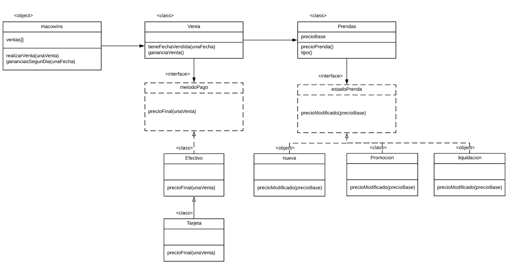

1) Requerimientos
Obtener el precio de una prenda
Obtener los tipos de prenda (saco, pantalones,camisas)
Registrar las ventas de las prendas
Sacar las ganancias de un determinado dia
Poder pagarse con efectivo o tarjeta

2) diagrama de clases y Codigo

3)Explicaciones en prosa necesarias

4)Cosas descartadas:
Podriamos usar la clase NuevaPrenda y que esta sea heredada por las clases Saco, Pantalon, Camisa. De esta forma se marca el tipo de ropa al momento de ingresar
la prenda vendida.